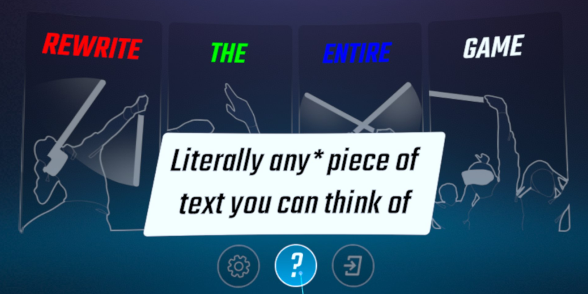

# AnyText

Change any text in the game through a list of find and replace instructions.

## Known Bugs

- Replacing "practice" will decapitalize many buttons
- Replacing a menu banner will decapitalize all menu banners
- Creating many rows will make the buttons lag

## v1.1.0 To-Do

- [x] Create `FindReplaceEntry` class
- [x] Create `Config` class
- [x] Load config files
- [x] Create `TextManager` component to handle text state
- [x] Create `TextIdentifier` to add and remove `TextManager` component
- [x] Load config files in specific order
- [x] Set up `AnyTextFlowCoordinator`
- [x] Set up `ConfigListViewController`
- [x] Display each config as a row
- [x] Set up `EntryListViewController`
- [x] Display each entry as a row
  - [x] Add input field for find string
  - [x] Add input field for replace string
  - [x] Add button to open find settings
  - [x] Add button to open replace settings
  - [x] Add buttons to reorder entry
  - [x] Add button to remove entry
- [x] Add modal for find settings
- [x] Add dropdown for find algorithm
- [x] Add toggle for accumulation
- [ ] Add modal for replace settings
- [ ] Add toggles to configs
- [x] Add button to create new config
- [x] Add button to create new entry
- [x] Add RegEx (then use it for everything)
- [x] Add find with match case
- [ ] Add replace all or partial
- [ ] Add replace text style settings
- [ ] Add position offset
- [ ] Add proper icons to buttons
- [x] ~~Fix large text being hidden behind ellipsis~~ (Tried a bunch of text options, TMPro doesn't seem to account for text overflow when right aligned) (Technically not an issue with the system keyboard)
- [ ] Stop text identification on AnyText-related pieces of text
- [ ] Trigger text updates upon exiting AnyText menu
- [ ] Add hover hints
- [x] Upgrade v1.0.1 configs
- [x] Investigate `private System.Collections.IEnumerator global::UIKeyboardManager.SummonSystemKeyboardAndWaitForResponse(HMUI.InputFieldView input)`
  - [ ] Note that the game needs to be repatched with `oculus.software.overlay_keyboard` but IT DOES WORK HECK YEAAAHHH
  - [ ] Also note user if it detects the keyboard. `Android::Permission` does not work, measure time open instead
- [ ] Load fonts

## Known Bugs

- Open a modal, open a dropdown, close the dropdown. The dimmer behind the modal disappears. I think I saw MetaCore had a dropdown function with some weird extra code that just may have been the fix for this?

## Needs Testing

The current action builds will log every piece of text that is viewed. **Disable CrashReporter logs** and **do not share the log** if you believe it may contain sensitive data.

- Upgrading config from v1.0.1 needs stress testing
- Manually editing config shouldn't cause any crashes
- Editing configs should restore any text that no longer needs replacing
- General software testing (Throw in stupid configs and try to break it. Attempt what I haven't planned for)

## Build Instructions

Use `qpm s build` to build
Same goes for `qpm s copy` and `qpm s qmod`

## Credits

- [zoller27osu](https://github.com/zoller27osu), [Sc2ad](https://github.com/Sc2ad) and [jakibaki](https://github.com/jakibaki) - [beatsaber-hook](https://github.com/sc2ad/beatsaber-hook)
- [raftario](https://github.com/raftario)
- [Lauriethefish](https://github.com/Lauriethefish), [danrouse](https://github.com/danrouse) and [Bobby Shmurner](https://github.com/BobbyShmurner) for [this template](https://github.com/Lauriethefish/quest-mod-template)
- [Fern](https://github.com/Fernthedev) for recommending boost-regex for performance
- [Icons8](https://icons8.com)
  - [Settings](https://icons8.com/icon/83214/settings)
  - [Edit Pencil](https://icons8.com/icon/86372/edit-pencil)
  - [Keyboard](https://icons8.com/icon/rgf2JV5jJg3Q/keyboard)
  - [Trash](https://icons8.com/icon/85081/trash)
  - [Plus Math](https://icons8.com/icon/3VGu7LGKM46W/plus-math)
  - [Sort Up](https://icons8.com/icon/86870/sort-up)
  - [Sort Down](https://icons8.com/icon/85502/sort-down)