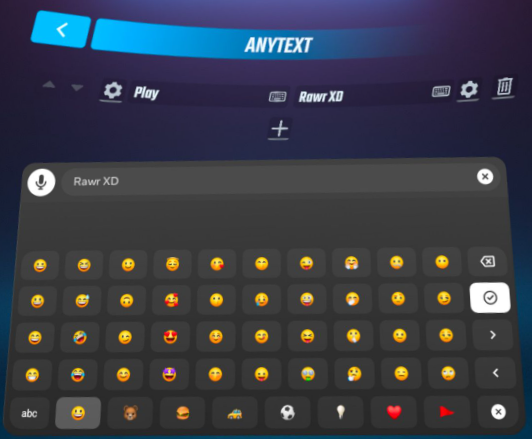
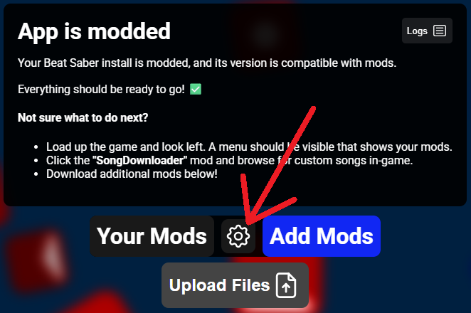
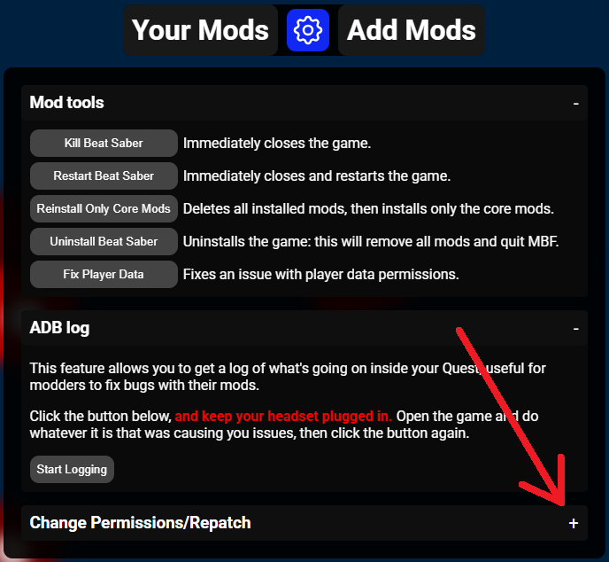
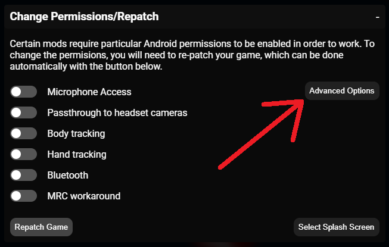
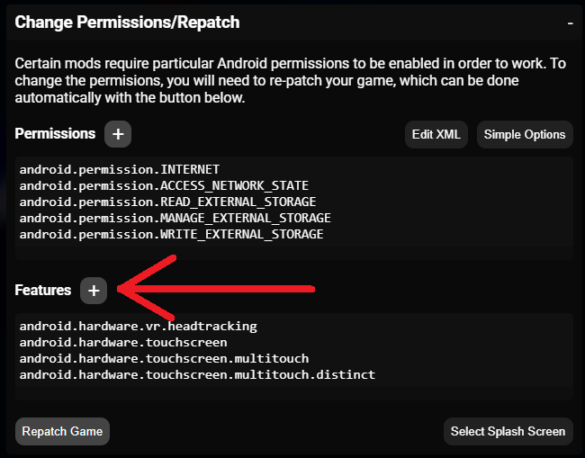
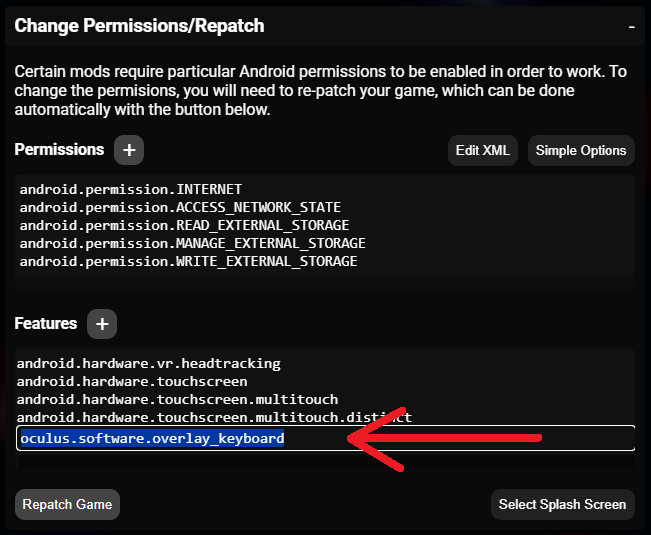
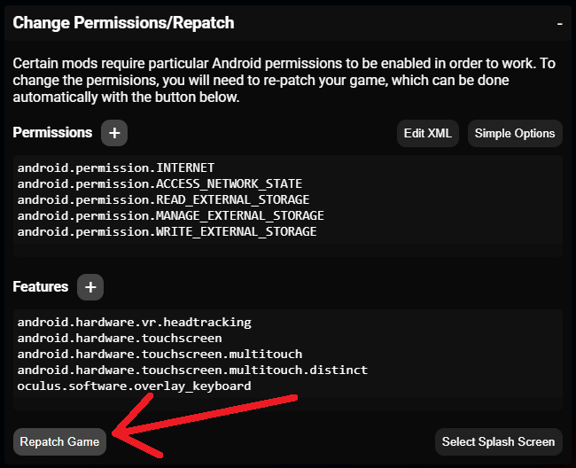

# AnyText Keyboard Setup

The Oculus keyboard makes it easy to type in **emojis, extra symbols, and other languages.** It also allows for copy/pasting, cursor movement, autocorrect, voice typing, and more.

To use the Oculus keyboard, Beat Saber needs to be repatched with the `oculus.software.overlay_keyboard` feature. See instructions below. 

> [!TIP]
> It may be helpful to open this page on a separate device.
> https://github.com/CatsaCode/AnyText/blob/main/docs/repatchInstructions/README.md

## Mods Before Friday Instructions

1. After connecting your headset, click on the **settings** button 
     

2. Expand the section for **Change Permissions/Repatch** 
     

3. Click on **Advanced Options** 
     

4. Click on the **plus** button to **add a feature** 
     

> [!IMPORTANT]
> This must be copied exactly or it will not work.

5. Type or copy/paste in **`oculus.software.overlay_keyboard`** 
     

6. Click on **Repatch Game** 
     

7. Relaunch Beat Saber and the keyboard icon should now open the Oculus keyboard

## Additional Help

If you use a different modding tool or run into any difficulties, ask for help in the **#quest-standalone-help** channel of the [BSMG Discord server](https://discord.gg/beatsabermods).